```mermaid
    graph TD 
        A[Inicio] --> B[Escribe tu contraseña];
        B --> C((Variable: pass));
        C --> D{¿Contraseña correcta?};
        
        D -- Sí --> E[Login correcto];
        D -- No --> F[Intentar de nuevo];
        
        F --> B; 
        E --> G[(Fin)];
```

```mermaid
    graph TD;
        A[Inicio] --> B[El usuario selecciona película, función y butaca]
        B --> C{¿Butaca disponible?}
        C -- No --> D[Mostrar mensaje de error] --> E[Fin]
        C -- Sí --> F[Reservar temporalmente la butaca]
        F --> G[El usuario ingresa datos de pago]
        G --> H[Procesar pago]
        H --> I{¿Pago aprobado?}
        I -- No --> J[Cancelar reserva de butaca] --> D
        I -- Sí --> K[Confirmar compra y generar ticket]
        K --> L[Mostrar ticket al usuario]
        L --> E
```

```mermaid
    sequenceDiagram
        participant Usuario
        participant App
        participant Servidor
        participant BaseDeDatos

        Usuario->>App: Ingresa datos de registro
        App->>Servidor: Envía datos de registro
        Servidor->>BaseDeDatos: Verifica si el usuario ya existe
        BaseDeDatos-->>Servidor: Respuesta (existe/no existe)
        
        alt Usuario no existe
            Servidor->>BaseDeDatos: Guarda nuevos datos de usuario
            BaseDeDatos-->>Servidor: Confirmación de guardado
            Servidor-->>App: Registro exitoso
            App-->>Usuario: Muestra mensaje de éxito
        else Usuario ya existe
            Servidor-->>App: Error - Usuario ya registrado
            App-->>Usuario: Muestra mensaje de error
        end
```

```mermaid
    sequenceDiagram
        participant Usuario
        participant App
        participant Servidor
        participant BaseDeDatos

        Usuario->>App: Ingresa credenciales
        App->>Servidor: Envía credenciales
        Servidor->>BaseDeDatos: Verifica credenciales
        BaseDeDatos-->>Servidor: Respuesta (válidas/inválidas)
        
        alt Credenciales válidas
            Servidor-->>App: Autenticación exitosa
            App-->>Usuario: Muestra pantalla de inicio
        else Credenciales inválidas
            Servidor-->>App: Error - Credenciales incorrectas
            App-->>Usuario: Muestra mensaje de error
        end
```

```mermaid
        sequenceDiagram
            participant Usuario
            participant App
            participant Servidor
            participant BaseDeDatos
            participant PasarelaDePago
        
            Usuario->>App: Selecciona película, función y butaca
            App->>Servidor: Envía solicitud de reserva
            Servidor->>BaseDeDatos: Verifica disponibilidad de la butaca
            BaseDeDatos-->>Servidor: Respuesta (disponible/no disponible)
            
            alt Butaca disponible
                Servidor->>BaseDeDatos: Reserva temporalmente la butaca
                Servidor-->>App: Solicita confirmación de pago
                Usuario->>App: Ingresa datos de pago
                App->>PasarelaDePago: Procesa pago
                PasarelaDePago-->>Servidor: Pago aprobado/rechazado
                
                alt Pago aprobado
                    Servidor->>BaseDeDatos: Confirma compra y guarda ticket
                    BaseDeDatos-->>Servidor: Compra registrada
                    Servidor-->>App: Confirmación de compra
                    App-->>Usuario: Muestra ticket y detalles de compra
                else Pago rechazado
                    Servidor->>BaseDeDatos: Cancela reserva de butaca
                    Servidor-->>App: Error - Pago rechazado
                    App-->>Usuario: Muestra mensaje de error
                end
            else Butaca no disponible
                Servidor-->>App: Error - Butaca no disponible
                App-->>Usuario: Muestra mensaje de error
            end
```

```mermaid
gitGraph
    commit id: "Configuración inicial"
    branch dev
    commit id: "Primer commit"
    checkout main
    commit id: "Implementación diagramas"
    merge dev
    commit id: "Implementación de imágenes y de videos"
    branch bugfix
    commit id: "Error 4de diagramas corregido"
    checkout dev
    commit id: "Implementación de diagrama Journey" tag: "Versión final"
    merge bugfix
    checkout main
    commit id: "Finalización del Read.me"
```

# Cine360

## ¿Qué es cine 360?📘

El proyecto consta de una innovadora idea la cual consiste en la implementación de 7 películas por semana (1 por día), estas tienen una temática concreta que en este caso son los diferentes géneros de cine.(De esta forma se le da sentido al nombre del proyecto ya que realiza un viaje 360 con los diferentes géneros de cine.)


## ¿Qué metodología he utilizado para este desarrollo?

Para el desarrollo de este proyecot he utilizado las metodologías ágiles, mas concretamente la metodología llamada __Scrum__, el motivo es que debido a las entregas que se nos piden que son en periodos de tiempo muy marcados y el material a entregar es conciso esto conbina perfectamente con los sprints, en los cuales puedo definir que objetivos quiero cumplir y cuales debo cumplir obligatoriamente para realizar la entrega de manera correcta.

### Video acerca de Scrum
[](https://www.youtube.com/watch?v=HhC75IonpOU)

### Web de explicación acerca de que es scrum

Si quieres saber más acerca de [SCRUM] puncha sobre la palabra.

[SCRUM]: https://proyectosagiles.org/que-es-scrum/

## ¿Que usuarios formaran parte de la aplicación? 🧑 

Dentro de la aplicación tendremos dos grupos de usuarios los cuales tendran diferentes acciones y funciones a realizar y estos seran __administrador__ y __usuario__.

## ¿Qué acciones podra realizar el usuario?

El usuario podra relizar diferentes funciones las cuales se van a enumerar y posteriormente explicar:

| Acciones Básicas |Acciones de Compras |  Devolver|
|----------------|----------------------|-------------------------|
| Registrares    | Comprar Promociones  | Devolver Promociones |
| Iniciar Sesión | Comprar Packs de comida| Devolver Packs de comida|
|Modificar Perfil| Comprar Butacas      |   Devolver Butacas| 

## Explicación de las acciones del usuario

En priemr lugar tenemos al acción de __registrarse__, que le permitira al usuario crear una cuenta en la aplicación para poder adquirir entradas, promociones o packs de comida.

En segundo lugar tenemos la acción de __iniciar sesión__, la cual permitira al usuario acceder a su cuenta anteriormente creada.

En tercer lugar tenemos la acción de __realizar cambios en su perfil__ que le permitira al usuario camiar desde _ajustes_ los diferentes datos acerca de su cuent que son _nombre del usuario_, _correo electrónico_ y _cambiar la contraseña_.

En cuarto lugar tenemos la acción de __navegar por todas sus ventanas__ que consistira en que pueda ver todo el contenido al cual se le permita acceder.

En quinto lugar tenemos __visualizar todas las películas disponibles__ de forma que pueda acceder a las semanas y visualizar tanto el género de peículas que se emitiran durante esa semana y las películas emitidas ademas de información acerca de estas.

En sexto lugar tenemos __reserva de butacas__ el usuario podra acceder a la visualización de una sala de cine y ver qeu butacas estan libre y cuales ocupadas, para asi poder adquirir una butaca sin generar problemas de malentendidos.

En septimo lugar tenemos __compra de packs de comida__ el usuario accedera a un apartado en el cual se le mostrara una imagen con información y el precio sobre los diferentes packs de comida que se ofrecen en cine 360, además de la opción de comprarla por la app.

En octavo lugar tenemos __compra de promociones__ el usuario podra acceder a un apartado donde se mostrara toda la información necesario acerca de la promoción y la opción de adquirirlo por la app.

En noveno lugar tenemos __devovler productos__ el usuario podra realizar la devolución de buátacas adquiridas para ver una película, libreandola asi para otros usuarios, packs de comida y promociones.


## ¿Qué acciones realizara el administrador?

El administrador podra realizar acciones meramente necesarias y administrativas y estas van a ser enumeradas y posteriormente explicadas.

1. Insertar películas.
2. Insertar promociones.
3. Insertar packs de comida. 
4. Insertar directores.
5. Insertar actores.
6. Modificar películas.
7. Modificar promociones.
8. Modificar packs de comida.
9. Modificar directores.
10. Modificar actores.
11. Eliminar poelículas.
12. Eliminar promociones.
13. Eliminar packs de comida.
14. Elimiar directores.
15. Eliminar acotres.

## Explicación de las acciones del administrador.

En __primer lugar__ tenemos la acción de insertar __películas__, esta acción le permitira al administrador añadir nuevas películas y insertar la información necesaria acerca de esta.

En __segundo lugar__ tenemos la acción de insertar __promociones__, esta acción le permitira al administrador añadir nuevas promociones y insertar la información necesaria acerca de esta.

En __tercer lugar__ tenemos la acción de insertar __packs de comida__, esta acción le permitira al administrador añadir nuevos packs de comida y insertar la información necesaria acerca de esta.

En __cuarto lugar__ tenemos la acción de insertar __directores__, esta acción le permitira al administrador añadir nuevos directores y insertar la información necesaria acerca de esta.

En __quinto lugar__ tenemos la acción de insertar __actores__, esta acción le permitira al administrador añadir nuevos actores y insertar la información necesaria acerca de esta.

En __sexto lugar__ tenemos la acción de modificar __películas__, esta acción le permitira al administrador modificar la información acerca de las diferentes películas disponibles en la app.


En __séptimo lugar__ tenemos la acción de modificar __promociones__, esta acción le permitira al administrador modificar la información acerca de las diferentes promociones disponibles en la app.

En __octavo lugar__ tenemos la acción de modificar  __packs de comida__, esta acción le permitira al administrador modificar la información acerca de las diferentes packs de comida disponibles en la app.

En __noveno lugar__ tenemos la acción de modificar  __directores__, esta acción le permitira al administrador modificar la información acerca de las diferentes directores disponibles en la app.

En __décimo lugar__ tenemos la acción de modificar  __actores__, esta acción le permitira al administrador modificar la información acerca de las diferentes actores disponibles en la app.


# ¿Qué herramientos y lenguajes he utilizado para su desarrollo? 💻 

Para el desarrollo de este proyecto he utilizado diferentes herramientas las cuales inidcare ahora y explicare que funciones tienen.

## Lenguaje de programación y base de datos utilizada

- Kotlin
- Sqlite

__Kotlin__ es un lenguaje de programación desarrollado a partir de java.

__Sqlite__ es una base de datos.


### Herramientas usadas para el desarrollo

| Entorno de desarrollo | MokUps |  Control de Versiones|
|----------------|---------------|---------------------- |
| Androdi Studio        | Figma  |  Github |


__Andorid Studio__ es un IDE utilizado principalmete para el desarrollo de aplicaciones orientadas a los usuarios de móvil, además permite la creación de la base de datos.

__Figma__ es una herramienta _on-line_ utilizada para el diseño de los mockups y realización de diferentes pruebas para tener una idea clara y una idea inicial de como quiero que sea el diseño de la aplicación.

__GitHub__ sistema de contol de versiones _on-line_ utilizado para poder realizar todo tipo de pruebas y realizar el desarrollo de la app mediante la creación de diferentes _ramas_ las cuales en caso de fallar no seria un problema gracias al guardado de versiones y en ningún momento se veria afectado el proyecto final.

__Canva__ utilizado para el diseño de todos los logos, packs de comida, promociones.

```mermaid
    graph TD
        A[Inicio] --> B(Usuario ingresa datos)
        B --> C{¿Datos válidos?};
        C -- No --> D[Muestra mensaje de error];
        D --> B;
        C -- Sí --> E[Enviar datos al servidor];
        E --> F{¿Usuario ya registrado?};
        F -- Sí --> G[Muestra mensaje de error];
        G --> B;
        F -- No --> H[Guardar usuario en la base de datos];
        H --> I[Muestra mensaje de éxito];
        I --> J[Fin];
```

# <center><p style="color:yellow;">Diagrama de Flujo</p></center>


### <u> Registro del usuario en la app </u>



###  <u> Inicio de sesión del usuario en la app</u>


###  <u>Compra del usuario de una promoción</u>


### <u>Compra del usuario de un pack de comida</u>


### <u>Compra del usuario de una butaca para una película</u>



# <center><p style="color:green;">Diagramas de Secuencia</p></center>

### <u>Diagrama de registro de un usuario en la app</u>



### <u>Diagrama de inicio de sesión de un usuario en la app</u>




### <u>Diagrama de compra de una butaca</u>


        
        
 ### <u>Diagrama de compra de una promocion</u>
        
 ```mermaid  
 sequenceDiagram     
         participant Usuario
            participant App
            participant Servidor
            participant BaseDeDatos
            participant PasarelaDePago
        
            Usuario->>App: Selecciona promocion
            App->>Servidor: Envía solicitud de reserva
            Servidor->>BaseDeDatos: Verifica disponibilidad de la promocion
            BaseDeDatos-->>Servidor: Respuesta (disponible/no disponible)
            
            alt promocion disponible
                Servidor->>BaseDeDatos: Compra temporalmente la promocion
                Servidor-->>App: Solicita confirmación de pago
                Usuario->>App: Ingresa datos de pago
                App->>PasarelaDePago: Procesa pago
                PasarelaDePago-->>Servidor: Pago aprobado/rechazado
                
                alt Pago aprobado
                    Servidor->>BaseDeDatos: Confirma compra y guarda ticket
                    BaseDeDatos-->>Servidor: Compra registrada
                    Servidor-->>App: Confirmación de compra
                    App-->>Usuario: Muestra ticket y detalles de compra
                else Pago rechazado
                    Servidor->>BaseDeDatos: Cancela compra de promocion
                    Servidor-->>App: Error - Pago rechazado
                    App-->>Usuario: Muestra mensaje de error
                end
            else promocion no disponible
                Servidor-->>App: Error - promocion no disponible
                App-->>Usuario: Muestra mensaje de error
            end
```        
        
### <u>Diagrama de compra de un pack de comida</u>


### <u>Diagrama de compra de una butaca</u>


www

# <center><p style="color:red;">Diagramas de entidad Relacion </p></center>

### <u>Diagrama de registro</u>


### <u>Diagrama de inicio de sesión</u>


 # <center><p style="color:red;">Diagramas de entidad Relacion </p></center>
        
 ### <u>Diagrama de registro</u>


### Diagrama Inicio de sesion

```mermaid
    erDiagram
        Usuario {
            int id_usuario PK
            string nombre
            string correo
            string contrasena
            boolean estado
        }
        
        Rol {
            int id_rol PK
            string nombre_rol
        }
        
        Historial_Sesion {
            int id_historial PK
            int id_usuario FK
            datetime fecha_inicio
            datetime fecha_fin
            string direccion_ip
        }
        
        Usuario ||--o{ Historial_Sesion : "tiene"
        Usuario }o--|| Rol : "puede tener"
 ```


# <center><p style="color:Blue;">Gráfica de timpo invertido</p></center>

```mermaid
pie showData
    title Lenguajes utilizados en el proyecto
    "Programación": 20
    "Documentación": 20
    "Solución de errores": 20
    "Búsqueda de información": 20


```

# <center><p style="color:Green;">Diagrama Git</p></center>



# <center><p style="color:Violet;">Diagrama Gantt</p></center>


# <center><p style="color:Orange;">Diagrama de Requirimientos</p></center>

```mermaid


 

```


# <center><p style="color:Brown;">Diagrama Journey</p></center>


