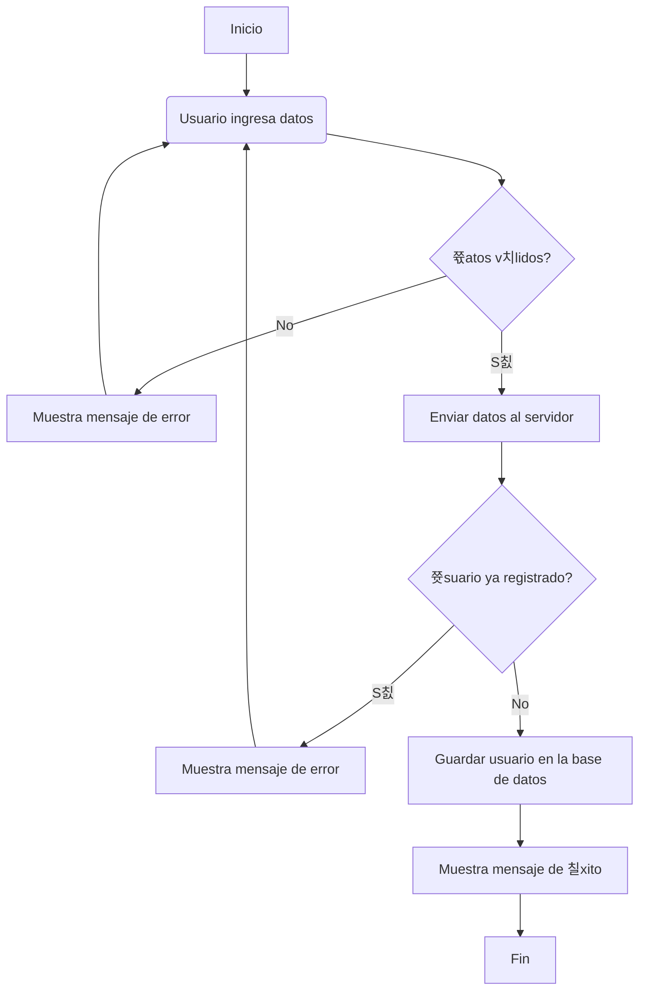
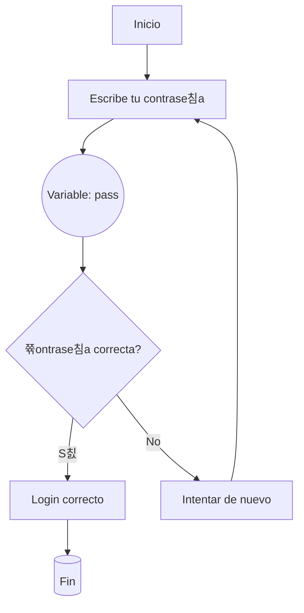
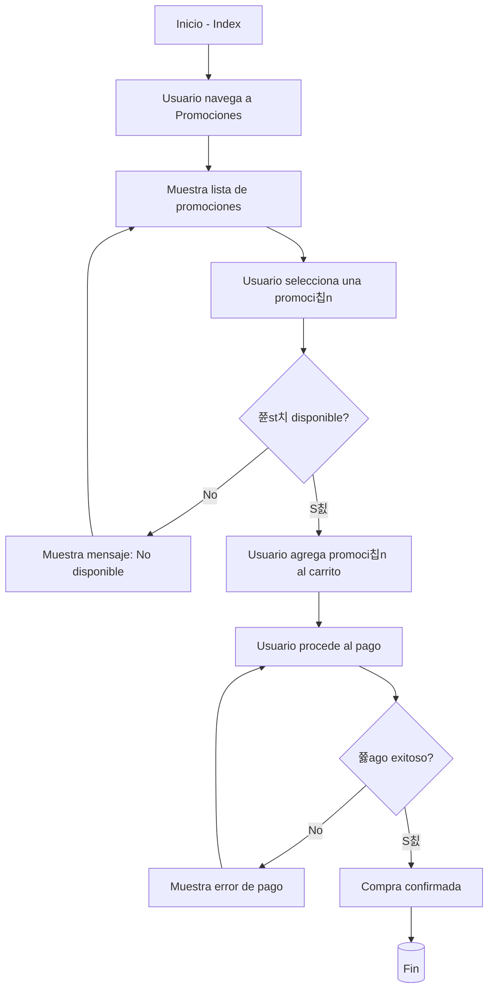
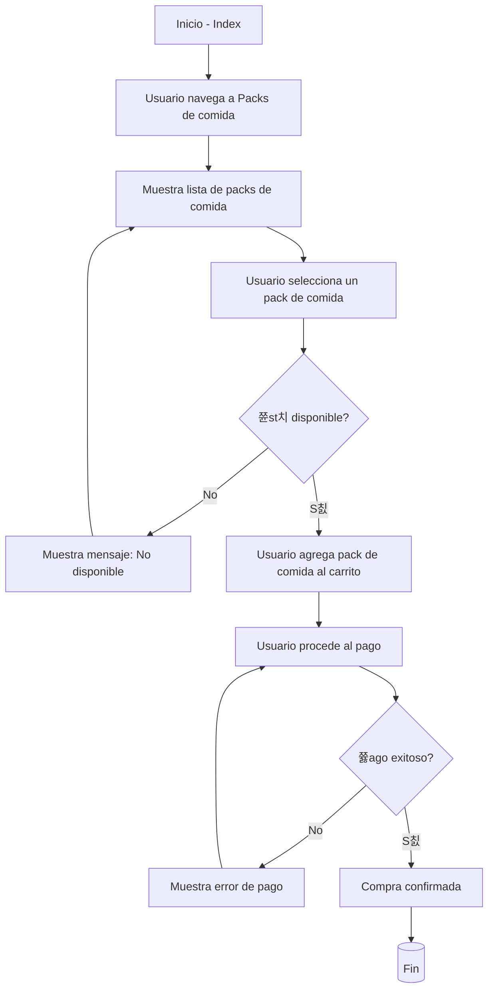
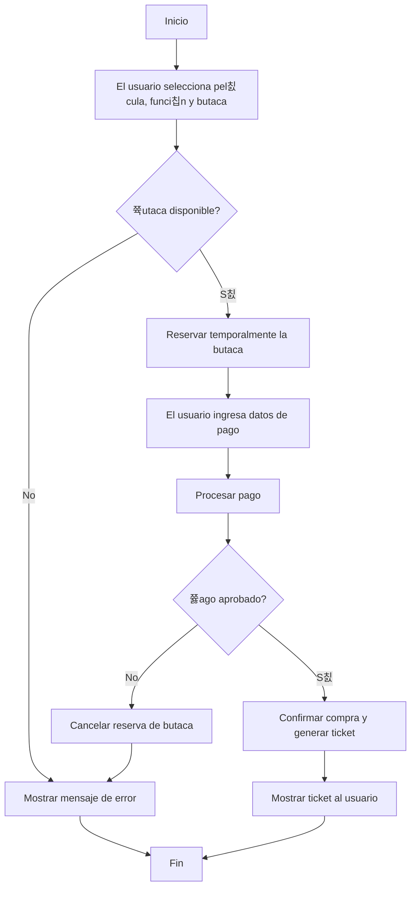
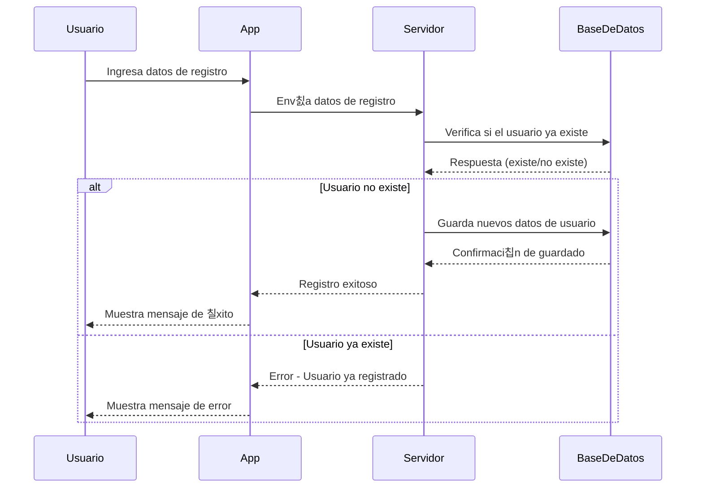
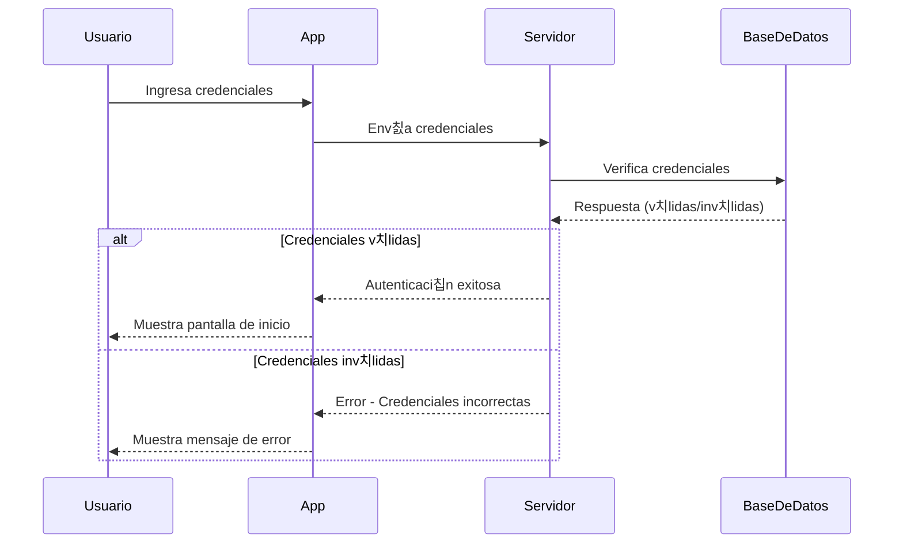
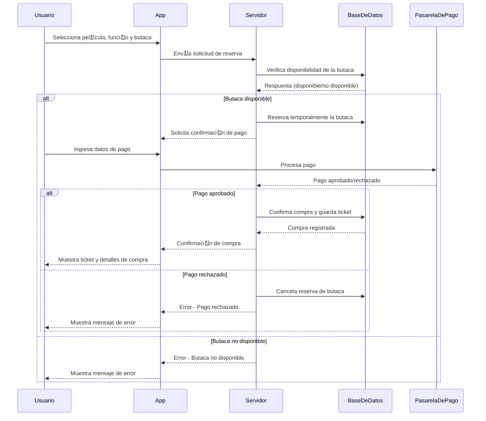
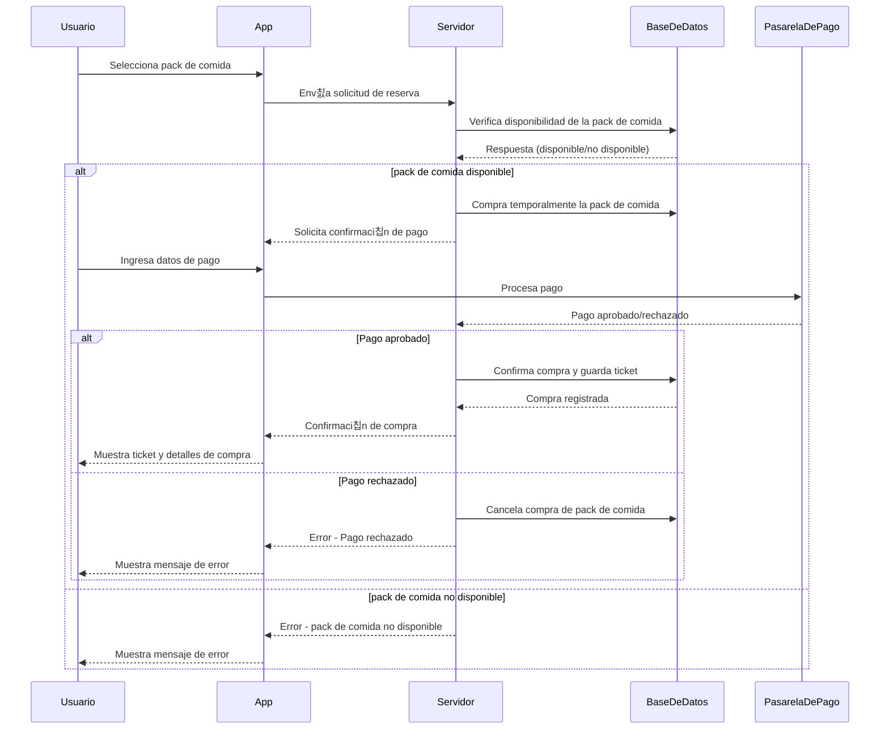
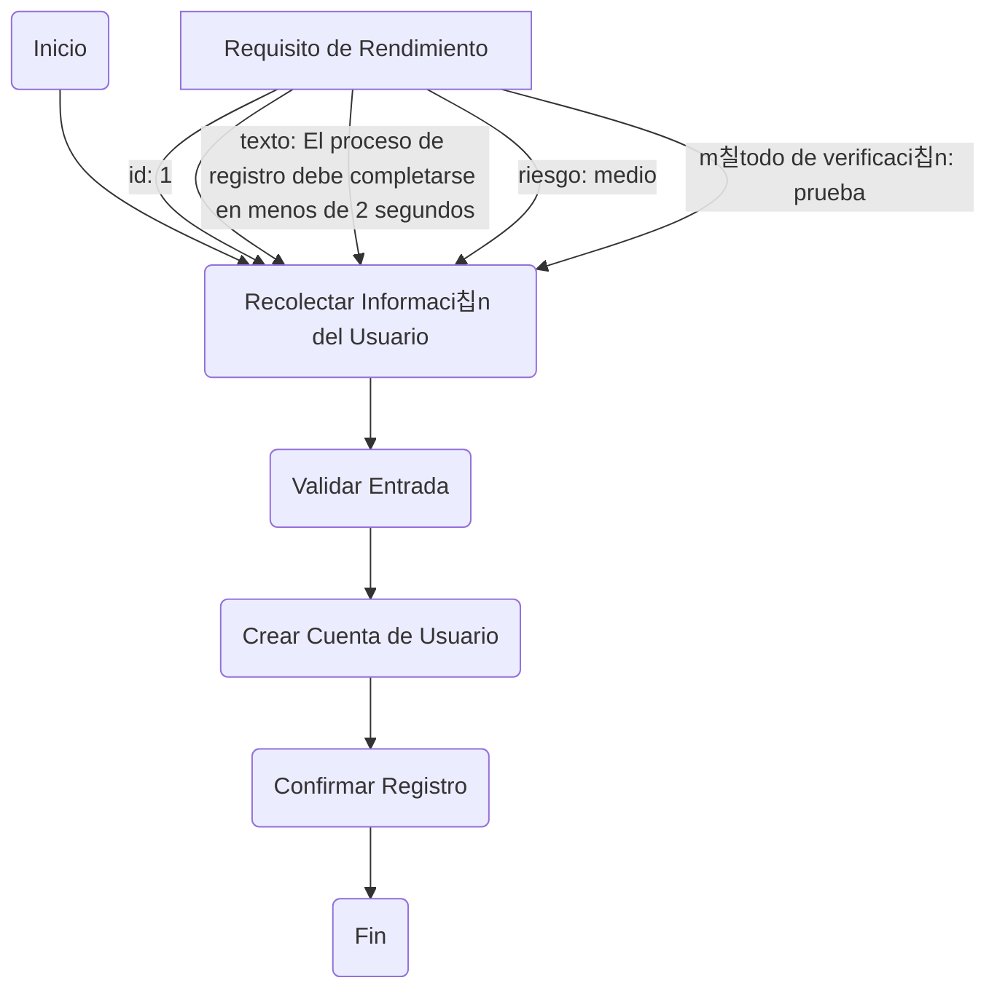

# <center><h1>Cine360</h1></center>

## <center> Qué es cine 360?📘</center>

El proyecto consta de una innovadora idea la cual consiste en la implementación de 7 películas por semana (1 por día), estas tienen una temática concreta que en este caso son los diferentes géneros de cine.(De esta forma se le da sentido al nombre del proyecto ya que realiza un viaje 360 con los diferentes géneros de cine.)


## <center>쯈ué metodología he utilizado para este desarrollo?</center>

Para el desarrollo de este proyecot he utilizado las metodologías ágiles, mas concretamente la metodología llamada __Scrum__, el motivo es que debido a las entregas que se nos piden que son en periodos de tiempo muy marcados y el material a entregar es conciso esto conbina perfectamente con los sprints, en los cuales puedo definir que objetivos quiero cumplir y cuales debo cumplir obligatoriamente para realizar la entrega de manera correcta.

### <center>Video acerca de Scrum</center>

[](https://www.youtube.com/watch?v=HhC75IonpOU)

### <center>Web de explicación acerca de que es scrum</center>

Si quieres saber más acerca de [SCRUM] puncha sobre la palabra.

[SCRUM]: https://proyectosagiles.org/que-es-scrum/

[]([URL_del_vídeo](https://www.youtube.com/watch?v=HhC75IonpOU))


## <center>쯈ue usuarios formaran parte de la aplicación? 游븸</center>

Dentro de la aplicación tendremos dos grupos de usuarios los cuales tendran diferentes acciones y funciones a realizar y estos seran __administrador__ y __usuario__.

## <center>쯈ué acciones podra realizar el usuario?</center>

El usuario podra relizar diferentes funciones las cuales se van a enumerar y posteriormente explicar:

| Acciones Básicas |Acciones de Compras |  Devolver|
|----------------|----------------------|-------------------------|
| Registrares    | Comprar Promociones  | Devolver Promociones |
| Iniciar Sesión | Comprar Packs de comida| Devolver Packs de comida|
|Modificar Perfil| Comprar Butacas      |   Devolver Butacas| 

## <center>쯈ué acciones realizara el administrador?</center>

El administrador podra realizar acciones meramente necesarias y administrativas y estas van a ser enumeradas y posteriormente explicadas.

1. Insertar películas.
2. Insertar promociones.
3. Insertar packs de comida. 
4. Insertar directores.
5. Insertar actores.
6. Modificar películas.
7. Modificar promociones.
8. Modificar packs de comida.
9. Modificar directores.
10. Modificar actores.
11. Eliminar poelículas.
12. Eliminar promociones.
13. Eliminar packs de comida.
14. Elimiar directores.
15. Eliminar acotres.

# <center>쯈ué herramientos y lenguajes he utilizado para su desarrollo? 游눹</center>

Para el desarrollo de este proyecto he utilizado diferentes herramientas las cuales inidcare ahora y explicare que funciones tienen.

## <center>Lenguaje de programación y base de datos utilizada</center>

- Kotlin
- Sqlite

__Kotlin__ es un lenguaje de programación desarrollado a partir de java.

__Sqlite__ es una base de datos.


### <center>Herramientas usadas para el desarrollo</center>

| Entorno de desarrollo | MokUps |  Control de Versiones|
|----------------|---------------|---------------------- |
| Androdi Studio        | Figma  |  Github |


__Andorid Studio__ es un IDE utilizado principalmete para el desarrollo de aplicaciones orientadas a los usuarios de móvil, además permite la creación de la base de datos.

__Figma__ es una herramienta _on-line_ utilizada para el diseño de los mockups y realización de diferentes pruebas para tener una idea clara y una idea inicial de como quiero que sea el diseño de la aplicación.

__GitHub__ sistema de contol de versiones _on-line_ utilizado para poder realizar todo tipo de pruebas y realizar el desarrollo de la app mediante la creación de diferentes _ramas_ las cuales en caso de fallar no seria un problema gracias al guardado de versiones y en ningún momento se veria afectado el proyecto final.

__Canva__ utilizado para el diseño de todos los logos, packs de comida, promociones.

# <center><p style="color:yellow;">Diagrama de Flujo</p></center>


### <center><u>Registro del usuario en la app </u>



###  <center><u> Inicio de sesión del usuario en la app</u></center>


###  <center><u>Compra del usuario de una promoción</u></center>



### <center><u>Compra del usuario de un pack de comida</u></center>



### <center><u>Compra del usuario de una butaca para una película</u></center>




# <center><p style="color:green;">Diagramas de Secuencia</p></center>

### <center><u>Diagrama de registro de un usuario en la app</u></center>



### <center><u>Diagrama de inicio de sesión de un usuario en la app</u></center>




### <center><u>Diagrama de compra de una butaca</u></center>


        
        
 ### <center><u>Diagrama de compra de una promocion</u></center>
        
 ```mermaid  
 sequenceDiagram     
         participant Usuario
            participant App
            participant Servidor
            participant BaseDeDatos
            participant PasarelaDePago
        
            Usuario->>App: Selecciona promocion
            App->>Servidor: Envía solicitud de reserva
            Servidor->>BaseDeDatos: Verifica disponibilidad de la promocion
            BaseDeDatos-->>Servidor: Respuesta (disponible/no disponible)
            
            alt promocion disponible
                Servidor->>BaseDeDatos: Compra temporalmente la promocion
                Servidor-->>App: Solicita confirmación de pago
                Usuario->>App: Ingresa datos de pago
                App->>PasarelaDePago: Procesa pago
                PasarelaDePago-->>Servidor: Pago aprobado/rechazado
                
                alt Pago aprobado
                    Servidor->>BaseDeDatos: Confirma compra y guarda ticket
                    BaseDeDatos-->>Servidor: Compra registrada
                    Servidor-->>App: Confirmación de compra
                    App-->>Usuario: Muestra ticket y detalles de compra
                else Pago rechazado
                    Servidor->>BaseDeDatos: Cancela compra de promocion
                    Servidor-->>App: Error - Pago rechazado
                    App-->>Usuario: Muestra mensaje de error
                end
            else promocion no disponible
                Servidor-->>App: Error - promocion no disponible
                App-->>Usuario: Muestra mensaje de error
            end
```        
        
### <center><u>Diagrama de compra de un pack de comida</u></center>



### <center><u>Diagrama de compra de una butaca</u></center>


# <center><p style="color:red;">Diagramas de entidad Relacion </p></center>

### <center><u>Diagrama de registro</u></center>


### <center><u>Diagrama de inicio de sesión</u></center>

```mermaid        
        erDiagram
            Usuario {
                int id_usuario PK
                string nombre
                string correo
                string contrasena
                boolean estado
            }
            
            Rol {
                int id_rol PK
                string nombre_rol
            }
            

            Historial_Sesion {

            Historial_Sesión {

                int id_historial PK
                int id_usuario FK
                datetime fecha_inicio
                datetime fecha_fin

                string direccion_ip
            }
            
           
            Usuario ||--o{ Historial_Sesion : "tiene"
            Usuario }o--|| Rol : "puede tener" 

                string dirección_ip
            }
            
            Usuario ||--o{ Historial_Sesión : "tiene"
            Usuario }o--|| Rol : "puede tener"
        
    }
    

```


 # <center><p style="color:red;">Diagramas de entidad Relacion </p></center>
        
 ### <center><u>Diagrama de registro</u></center>


### <center><u>Diagrama Inicio de sesion</u></center>

```mermaid
    erDiagram
        Usuario {
            int id_usuario PK
            string nombre
            string correo
            string contrasena
            boolean estado
        }
        
        Rol {
            int id_rol PK
            string nombre_rol
        }
        
        Historial_Sesion {
            int id_historial PK
            int id_usuario FK
            datetime fecha_inicio
            datetime fecha_fin
            string direccion_ip
        }
        
        Usuario ||--o{ Historial_Sesion : "tiene"
        Usuario }o--|| Rol : "puede tener"
 ```


# <center><p style="color:Blue;">Gráfica de timpo invertido</p></center>

```mermaid
pie showData
    title Lenguajes utilizados en el proyecto
    "Programación": 20
    "Documentación": 20
    "Solución de errores": 20
    "Búsqueda de información": 20


```

# <center><p style="color:Green;">Diagrama Git</p></center>


# <center><p style="color:Violet;">Diagrama Gantt</p></center>


# <center><p style="color:Orange;">Diagrama de Requirimientos</p></center>




# <center><p style="color:Brown;">Diagrama Journey</p></center>


